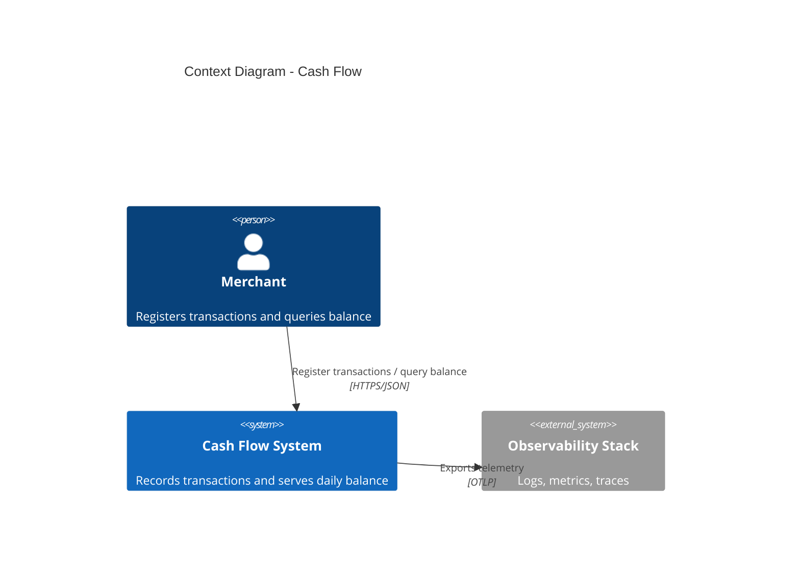
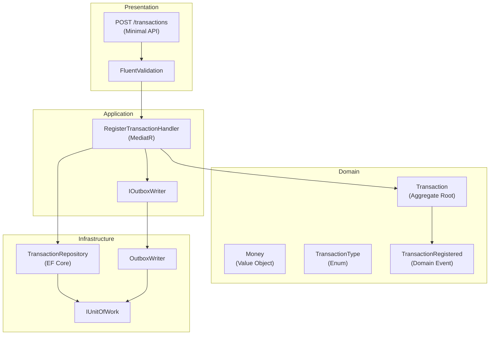
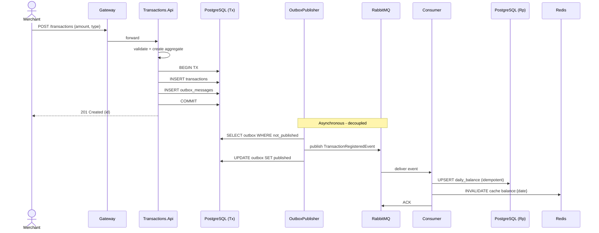
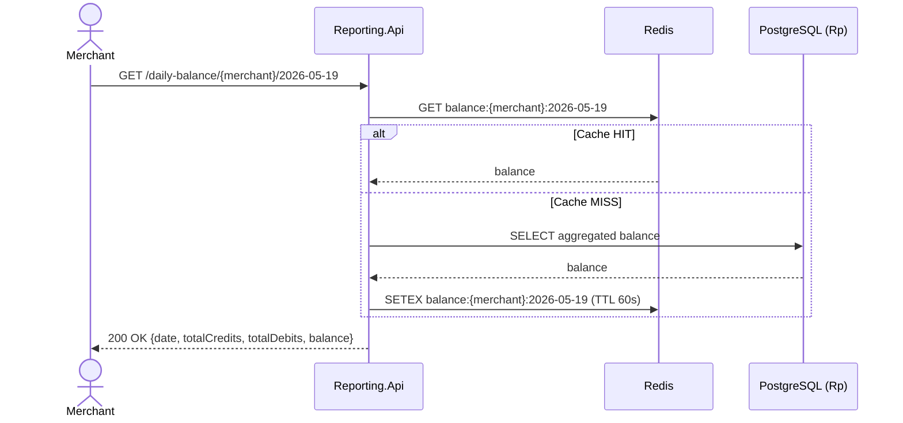
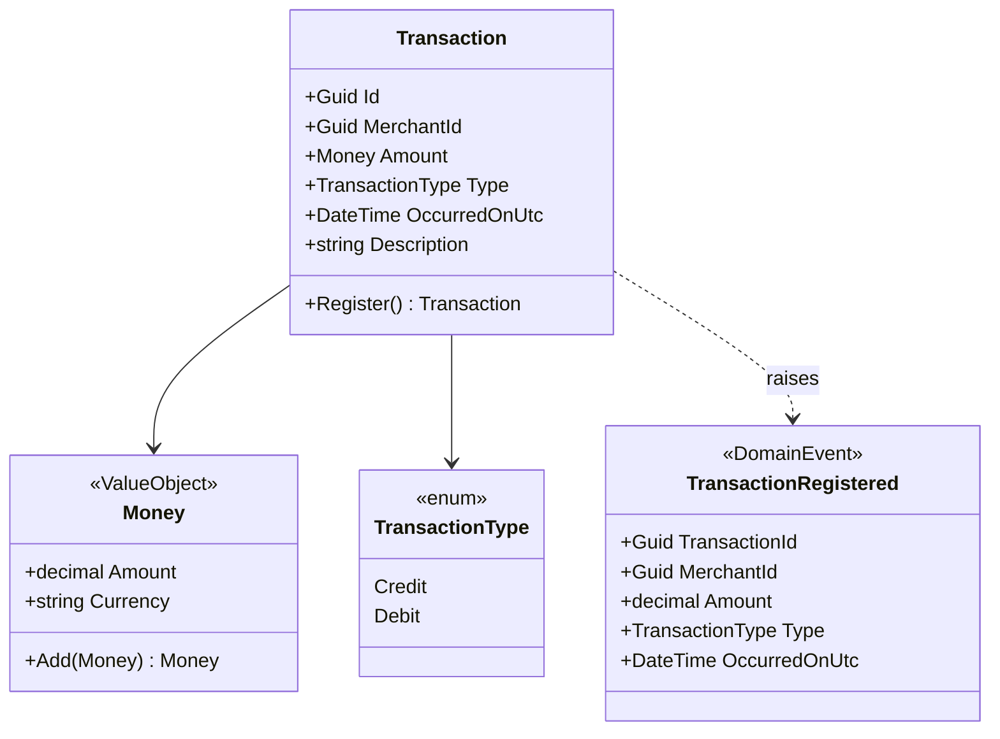
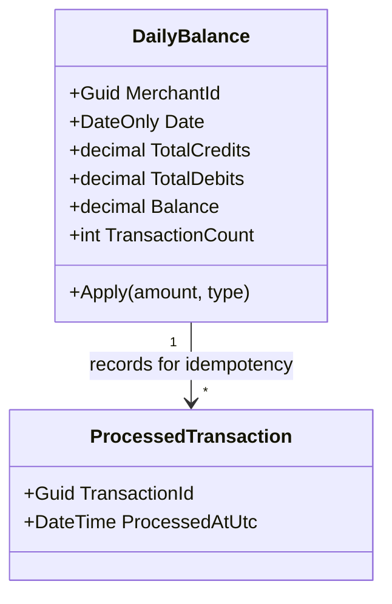

# Architecture - Cash Flow System

> Architecture document for the Software Architect challenge.
> Daily cash flow control system (debit/credit transactions + consolidated daily balance).

---

## 1. Overview

A merchant (`Merchant`) needs to register financial transactions - debits (`Debit`) and credits (`Credit`) - throughout the day and query the consolidated daily balance (`DailyBalance`). The solution is composed of **two independent services** (bounded contexts `Transactions` and `Reporting`) that communicate asynchronously via messaging, meeting the non-functional requirements of availability and failure isolation required by the challenge.

| Item | Value |
|---|---|
| Language | C# / .NET 8 |
| Architectural style | Microservices + Event-Driven + lightweight CQRS |
| Communication | Asynchronous (RabbitMQ) + external synchronous REST |
| Persistence | PostgreSQL (database per service) + Redis (cache) |
| Local infra | Docker Compose |

---

## 2. Requirements

### 2.1. Business Requirements

- Register transactions (debits and credits) for a merchant.
- Provide a consolidated daily balance report.

### 2.2. Non-functional Requirements (architectural drivers)

| ID | Requirement | Architectural implication |
|---|---|---|
| NFR-01 | The `Transactions` service **must not** become unavailable if `Reporting` goes down | Total decoupling via messaging; `Transactions` NEVER calls `Reporting` synchronously |
| NFR-02 | `Reporting` supports **50 req/s** at peak | Redis cache + optimized read (materialized `DailyBalance` model) |
| NFR-03 | Tolerance of **up to 5% loss** on `Reporting` | Allows circuit breaker + graceful fallback; does not require exactly-once guarantee |
| NFR-04 | Transaction integrity | Outbox Pattern + idempotency in the consumer |
| NFR-05 | Observability | Structured logs + metrics + distributed traces |

---

## 3. Architectural Style

### Decision

**Microservices** with **event-driven communication** and **lightweight CQRS**.

### Why

- NFR-01 requires both services to have independent lifecycles (deploy, scale, failure). A modular monolith does not satisfy this honestly - `Reporting` going down would bring `Transactions` down if they shared a process.
- The load profiles are distinct: `Transactions` is write-heavy with low frequency; `Reporting` is read-heavy with 50 req/s. Separating allows each to be scaled along its own axis.
- CQRS arises naturally: the write model (individual `Transaction`) differs from the read model (`DailyBalance` aggregated by day). It does not need to be "pure" CQRS with Event Sourcing - just separate command from query and materialize the read.

### Accepted trade-offs

- **Eventual consistency** between `Transactions` and `Reporting`. Acceptable: a daily balance report does not require strong consistency (delay of milliseconds to seconds is tolerable).
- **Higher operational complexity** (broker, two databases, distributed observability). Justified by the NFRs.

---

## 4. C4 Diagrams

> The Mermaid blocks below render natively on GitHub. The sources are duplicated in [`docs/diagrams/`](diagrams/) as standalone `.mmd` files. To export PNG/SVG (useful for presentations), run `make diagrams` or see [`docs/diagrams/README.md`](diagrams/README.md).

### 4.1. Level 1 - Context



### 4.2. Level 2 - Containers

```mermaid
flowchart LR
    Client[("Merchant<br/>(Web/Mobile)")]
    Gateway["API Gateway<br/>(YARP / Nginx)"]

    subgraph Transactions["Bounded Context: Transactions"]
        ApiTx["Transactions.Api<br/>(ASP.NET Core)"]
        DBTx[("PostgreSQL<br/>transactions_db")]
        Outbox[/"OutboxPublisher<br/>(BackgroundService)"/]
    end

    Broker{{"RabbitMQ<br/>(Exchange: transactions)"}}

    subgraph Reporting["Bounded Context: Reporting"]
        Consumer[/"TransactionRegisteredConsumer<br/>(BackgroundService)"/]
        ApiRp["Reporting.Api<br/>(ASP.NET Core)"]
        DBRp[("PostgreSQL<br/>reporting_db")]
        Cache[("Redis<br/>(daily balance)")]
    end

    Client -->|HTTPS| Gateway
    Gateway -->|POST /transactions| ApiTx
    Gateway -->|GET /daily-balance/{date}| ApiRp
    ApiTx --> DBTx
    DBTx -.->|poll outbox| Outbox
    Outbox -->|publish| Broker
    Broker -->|consume| Consumer
    Consumer --> DBRp
    ApiRp --> DBRp
    ApiRp --> Cache
```

### 4.3. Level 3 - Components (Transactions.Api, Clean Architecture)



### 4.4. Flow - Transaction Registration (sequence)



### 4.5. Flow - Daily Balance Query



---

## 5. Domain Model

### 5.1. Bounded Context: Transactions



**Invariants of the `Transaction` aggregate:**
- `Amount` strictly positive (the sign is given by `Type`, never by the value).
- `OccurredOnUtc` cannot be in the future.
- Immutable after creation (registration only, no updates).

### 5.2. Bounded Context: Reporting



The `processed_transactions` table guarantees **idempotency**: if the same event arrives twice (RabbitMQ delivers *at-least-once*), the second one is discarded.

---

## 6. Architecture Decision Records (summarized)

### ADR-001: Microservices instead of modular monolith

- **Status:** Accepted
- **Context:** NFR-01 requires that a `Reporting` failure does not affect `Transactions`.
- **Decision:** Two independent services, separate deploys and databases.
- **Consequences:** + Real failure isolation, independent scaling. - Higher operational complexity, additional latency, eventual consistency.

### ADR-002: Asynchronous communication via broker

- **Status:** Accepted
- **Context:** A synchronous call would violate NFR-01.
- **Decision:** `Transactions` publishes `TransactionRegisteredEvent`; `Reporting` consumes it.
- **Alternatives:** Synchronous REST call (rejected - couples availability), polling (rejected - latency and waste).

### ADR-003: RabbitMQ as the broker

- **Status:** Accepted
- **Context:** We need a mature broker that is simple to operate locally.
- **Decision:** RabbitMQ with a `topic` exchange, durable queue, configured DLQ.
- **Alternatives:** Kafka (overkill for the volume; high operational complexity for the challenge scope); Azure Service Bus / AWS SQS (cloud lock-in).

### ADR-004: Outbox Pattern for reliable publishing

- **Status:** Accepted
- **Context:** We need to ensure the event is published **if and only if** the transaction was persisted. Publishing directly from the handler creates an inconsistency window (DB commit ok, broker fails, event lost).
- **Decision:** Insert the event into the `outbox_messages` table in the same transaction as the `Transaction`. A `BackgroundService` (OutboxPublisher) polls and publishes to the broker, marking as published.
- **Consequences:** + *At-least-once* delivery guarantee. - Additional latency (poll interval); requires idempotency in the consumer.

### ADR-005: Lightweight CQRS (no Event Sourcing)

- **Status:** Accepted
- **Decision:** Rich write model (`Transaction` aggregate), materialized read model (`DailyBalance`) updated by events.
- **Why not pure Event Sourcing:** High adoption cost, no requirement for temporal auditing or replay; YAGNI.

### ADR-006: PostgreSQL + Redis

- **Status:** Accepted
- **Decision:** PostgreSQL as the main database (one per service); Redis as the read cache in `Reporting`.
- **Cache TTL:** 60s for the current day's `DailyBalance`; cache-aside with active invalidation in the consumer on update.

### ADR-007: Resilience with Polly

- **Status:** Accepted
- **Decision:** Exponential retry with jitter + Circuit Breaker on all external calls (broker, cache, DB transient errors). Bulkhead to isolate connection pools.

### ADR-008: Idempotency in the consumer

- **Status:** Accepted
- **Decision:** The `processed_transactions` table stores IDs already consumed; unique insert before applying. The combination of `UPSERT` in `daily_balances` + dedup table ensures that reprocessing does not duplicate the balance.

### ADR-009: Clean Architecture / Hexagonal per service

- **Status:** Accepted
- **Decision:** Each service structured in layers Domain -> Application -> Infrastructure -> API. Dependencies point inward. Unit tests on the domain, integration with Testcontainers.

---

## 7. Technology Stack

| Layer | Technology | Rationale |
|---|---|---|
| Runtime | .NET 8 (LTS) | Stable until 2026, performance and ecosystem |
| API | ASP.NET Core Minimal APIs | Low boilerplate, performance |
| Mediator | MediatR | Clean CQRS, behaviors pipeline (validation, logging) |
| Validation | FluentValidation | Declarative validation, testable |
| ORM | EF Core 8 | Maturity, migrations, LINQ |
| Broker | RabbitMQ + MassTransit | Abstraction that avoids coupling to the native client |
| Cache | Redis (StackExchange.Redis) | Industry standard |
| Resilience | Polly | Retry, CB, Bulkhead - standard in .NET |
| Logs | Serilog (structured JSON) | Configurable sink (console, Seq, Elastic) |
| Metrics/Traces | OpenTelemetry | Vendor-neutral standard, exports to Prometheus/Jaeger |
| Unit tests | xUnit + FluentAssertions + NSubstitute | Modern standard stack |
| Integration tests | Testcontainers + WebApplicationFactory | Spins up real Postgres/RabbitMQ in containers |
| Load test | NBomber | Validate the 50 req/s of NFR-02 |
| Containerization | Docker + Docker Compose | Local setup with 1 command |
| API documentation | Swagger / OpenAPI | Standard |

---

## 8. Folder Structure

```
cash-flow/
├── docs/
│   ├── ARCHITECTURE.md           (this document)
│   ├── adr/                      (9 ADRs in Michael Nygard format)
│   └── diagrams/                 (.mmd sources of the C4 diagrams)
│
├── docker-compose.yml
├── docker-compose.infra.yml
├── README.md
├── CashFlow.sln
│
├── src/
│   ├── Transactions/
│   │   ├── Transactions.Api/                  (host, endpoints, DI)
│   │   ├── Transactions.Application/          (handlers, validators, ports)
│   │   ├── Transactions.Domain/               (aggregates, VOs, events, rules)
│   │   ├── Transactions.Infrastructure/       (EF Core, repos, outbox, messaging)
│   │   └── Transactions.Worker/               (OutboxPublisher BackgroundService)
│   │
│   ├── Reporting/
│   │   ├── Reporting.Api/                     (query endpoint)
│   │   ├── Reporting.Application/
│   │   ├── Reporting.Domain/
│   │   ├── Reporting.Infrastructure/          (EF Core, Redis)
│   │   └── Reporting.Worker/                  (TransactionRegisteredConsumer)
│   │
│   └── Shared/
│       ├── Shared.Contracts/                  (integration event DTOs — shared kernel)
│       └── Shared.Observability/              (OTel/Serilog extensions)
│
└── tests/
    ├── Transactions.UnitTests/
    ├── Transactions.IntegrationTests/
    ├── Reporting.UnitTests/
    ├── Reporting.IntegrationTests/
    └── CashFlow.LoadTests/                  (NBomber)
```

> Note on `Shared.Contracts`: the event contract is an intentional "shared kernel". It is the only coupling accepted between the bounded contexts - versioned and changed carefully.

---

## 9. Testing Strategy

| Type | Scope | Tool | Goal |
|---|---|---|---|
| Unit | Domain (aggregates, VOs, rules) | xUnit | Coverage of invariants and business rules |
| Unit | Application (handlers) | xUnit + NSubstitute | Orchestration behavior |
| Integration | API + real DB | Testcontainers (Postgres) | CRUD, transactions, outbox |
| Integration | Consumer + real Broker | Testcontainers (RabbitMQ) | Idempotency, dedup, DLQ |
| Contract | Events | Schema snapshot | Prevents accidental breakage |
| Load | Reporting.Api | NBomber | Validate 50 req/s with < 5% errors |
| End-to-end | Full flow | docker-compose + script | Regression smoke test |

---

## 10. Observability

- **Logs**: Serilog structured in JSON, with `CorrelationId` propagated via the `X-Correlation-Id` header and enriched in the `LogContext`. Local sink: console + Seq.
- **Metrics**: OpenTelemetry Metrics exposing via OTLP to Prometheus. Custom metrics:
  - `outbox_published_total` (counter)
  - `outbox_failed_total` (counter)
  - `balance_cache_hits_total` (counter)
  - `balance_cache_misses_total` (counter)
- **Tracing**: OpenTelemetry Traces exporting to Jaeger. Spans cover: HTTP -> Handler -> DB -> Outbox -> Broker -> Consumer -> DB.
- **Health Checks**: `/health/live` (liveness) and `/health/ready` (readiness, checks DB, broker, Redis).

---

## 11. Security

For the scope of the challenge, essential controls are implemented; items marked as *roadmap* are documented as future evolutions.

- **Transport**: HTTPS required (TLS 1.2+).
- **Authentication**: JWT Bearer with HMAC key for the challenge; pluggable for OIDC in production *(roadmap: integration with an IdP)*.
- **Authorization**: Policies by scope (`transactions:write`, `reporting:read`).
- **Input validation**: FluentValidation on all endpoints; rejects malformed payloads before touching the domain.
- **Secrets**: `dotnet user-secrets` in dev; placeholder for Vault/Azure Key Vault in prod.
- **Security headers**: HSTS, X-Content-Type-Options, Referrer-Policy.
- **Rate limiting**: `Microsoft.AspNetCore.RateLimiting` at the Gateway/API.
- **Auditing**: `Transaction`s are immutable; every operation is logged with `CorrelationId` + `MerchantId`.
- *(roadmap)* Column-level encryption at rest (amount/description), event signing, mTLS between services.

---

## 12. Meeting Non-functional Requirements

| NFR | How it is met |
|---|---|
| NFR-01 (Transactions independent of Reporting) | 100% asynchronous communication via RabbitMQ; no synchronous call between services. Transactions operates even with Reporting completely offline - events accumulate in the broker and/or in the outbox |
| NFR-02 (50 req/s on Reporting) | Redis cache with short TTL absorbs most reads; index on `(merchant_id, date)`; horizontally scalable behind the gateway |
| NFR-03 (up to 5% loss tolerable) | Circuit breaker allows degrading the response to a "stale" cached value; fallback returns the cached balance even with DB unavailable |
| NFR-04 (Integrity) | Transactional outbox + idempotency in the consumer (dedup by `transaction_id`) |
| NFR-05 (Observability) | OTel + Serilog + Health Checks + Grafana dashboards |

---

## 13. How to Run Locally (summary)

```bash
# Prerequisites: Docker, .NET 8 SDK
git clone <repo>
cd cash-flow

# Bring up infra + apps + observability
docker compose up -d --build

# Run the tests
dotnet test

# Load test (50 req/s)
dotnet run --project tests/CashFlow.LoadTests -c Release
```

Main endpoints:
- `POST /api/v1/transactions` - registers credit/debit
- `GET  /api/v1/transactions/{id}` - queries a transaction
- `GET  /api/v1/daily-balance/{merchantId}/{date}` - consolidated balance for a day
- `GET  /health/live` and `/health/ready`
- `GET  /swagger` on each service

---

## 14. Future Evolutions

Honest list of what **was not done** and why, demonstrating awareness of the trade-off between challenge scope and production maturity:

1. **Event Sourcing on `Transaction`** - for full temporal auditing and replay; today resolved with an immutable table + outbox, but event sourcing would provide a richer history of changes.
2. **Sharding by `merchant_id`** - needed if volume grows by orders of magnitude. Today the modeling already isolates data per merchant, making future partitioning easier.
3. **Multi-period materialization** - weekly/monthly balances as additional projections consuming the same event.
4. **API Gateway with BFF** - today Nginx handles simple routing; a BFF (YARP) would allow aggregation for mobile/web without leakage.
5. **OIDC authentication** - integration with Keycloak or similar; today JWT HMAC is sufficient for demonstration.
6. **Kubernetes + HPA** - Docker Compose is sufficient for the challenge; in production, k8s with HPA based on metrics (queue lag, p99 latency) would be the path.
7. **Schema Registry for events** - Avro/Protobuf + contract versioning (backward/forward compatibility).
8. **Chaos engineering** - automated failure tests (kill broker during load, kill Reporting DB and verify that Transactions keeps going).
9. **Backup & DR** - Postgres backup policy, defined RPO/RTO, DR runbook.
10. **Real multi-tenancy** - today `MerchantId` is just a key; in production, isolation by database/schema depending on the plan.
11. **Domain limits** - rules like "balance cannot go negative" are not in the statement, but would be a next aggregate/policy to model.
12. **CDC (Change Data Capture) with Debezium** - alternative to the OutboxPublisher; left on the list for discussion, but Outbox is simpler and sufficient.

---

## 15. Glossary (technical terms)

| Term | Definition |
|---|---|
| Outbox Pattern | Pattern that persists events alongside the business transaction for guaranteed later publishing |
| CQRS | Command Query Responsibility Segregation - separates read and write models |
| Idempotency | Property of an operation producing the same result when executed multiple times |
| DLQ | Dead Letter Queue - queue for messages that failed after retries |
| Aggregate / Aggregate Root | DDD: grouping of entities with a single transactional boundary |
| Value Object | DDD: immutable object defined by its attributes, without identity |

---

*Document maintained as part of the repository. Architectural changes must come with a new ADR.*
